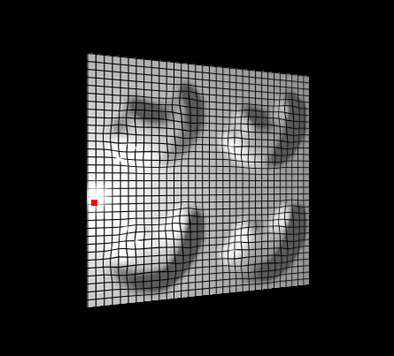
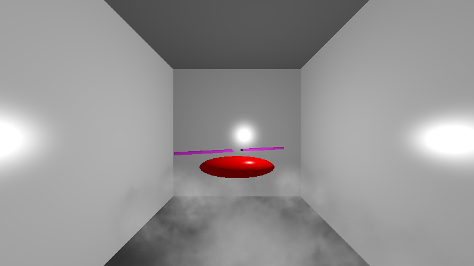
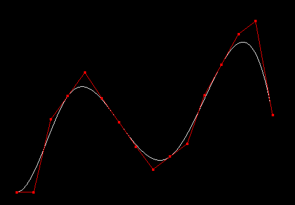
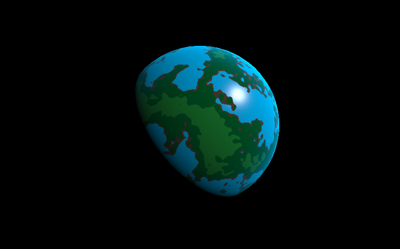
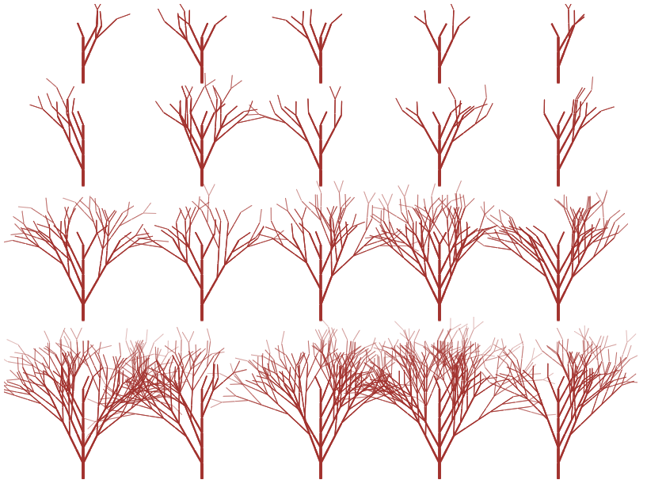
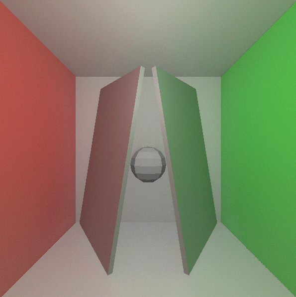
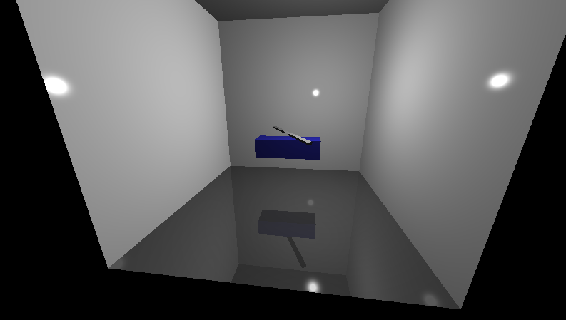
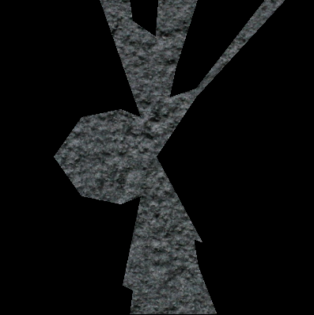

# Computer graphics projects

Created with C++ (OpenGL) or JavaScript (three.js).

If you want to run the projects yourself, clone the repo. Then, for the C++ projects, you can build the project using CodeBlocks and run it. For the JavaScript projects, just open the index.html file in a web-browser.

The following links lead to the more interesting projects in this repository.

---

#### [Texture/bump mapping (C++)](7/BumpMappingCPP/)

---

#### [Gamma-correct Phong lighting model, alpha blending (C++)](8/SoftParticleChopperCPP/)

---

#### [C0 to C2 smooth Bezier spline (C++)](10/BezierSplineCPP/)

---

#### [Perlin noise generated planet (JS)](11/PerlinPlanetJS/)

---

#### [Lindenmayer system generated tree (JS)](11/LindenmayerTreeJS/)

---

#### [Path-traced scene with ambient occlusion (JS)](13/PathTraceJS/)

---

#### [Simple reflection effect (C++)](14/ReflectedChopperCPP/)

---

#### [2D shadow algorithm (JS)](15/2DShadowsJS/)

